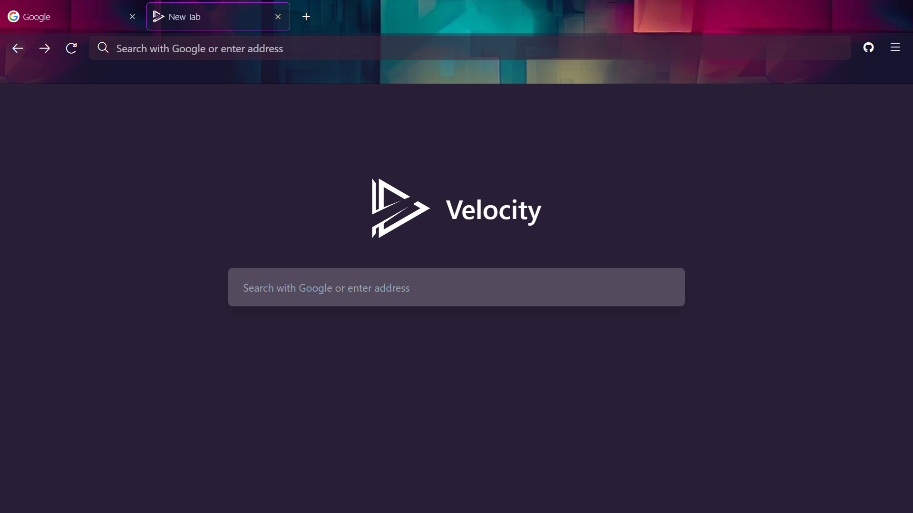

<div align="center">


# Velocity

Velocity is a fully featured tabbed proxy with a **seamless browsing experience**.

[Features](#features) •
[Deployment](#deployment) •
[Contributing](./CONTRIBUTING.md)



</div>

## Deploy

<a target="_blank" href="https://heroku.com/deploy/?template=https://github.com/Thisisanalthowcool/Velocity/"></a>
<a target="_blank" href="https://github.com/Thisisanalthowcool/Velocity/"></a>
<a target="_blank" href="https://github.com/Thisisanalthowcool/Velocity/"></a>
<a target="_blank" href="https://app.koyeb.com/deploy?type=git&repository=github.com/Thisisanalthowcool/Velociy&branch=main&name=Velocity"></a>
<a target="_blank" href="https://github.com/Thisisanalthowcool/Velocity/"></a>

## Features

- Sleek Firefox inspired UI
- Advanced link handling
- Script injection for native functions
- Support for themes installed through the Firefox addon store
- Custom styled context menus
- PWA enabled

### Internal URL's

- `about:newTab` - New tab page
- `about:preferences` - Preferences page
- `about:history` - History page
- `about:blank` - Blank document
- `view-source:*` - View source page

### Shortcuts

Velocity implements standard keyboard shortcuts that web browsers use in order to navigate. Due to the limitations of JavaScript, some of these have to be adapted to be slightly different.

- `Ctrl + R` - Reload current tab
- `Ctrl + E` - Search
- `Ctrl + U` - View page source
- `Ctrl + Shift + I` - Open developer tools
- `Alt + ArrowLeft` - Navigate backwards in history
- `Alt + ArrowRight` - Navigate forward in history
- `Ctrl + D` - Bookmark current page
- `Ctrl + Shift + B` - Toggle bookmarks bar
- `Ctrl + H` - Open history

### Adapted Shortcuts

- `Alt + T` - Open new tab (originally `Ctrl + T`)
- `Alt + W` - Close current tab (originally `Ctrl + W`)

## API

Velocity exposes certain APIs in order to allow developers to easily incorperate Velocity into their own projects. To learn more, check out the [API Docs](/docs/API.md).

## Deployment

### Quick Deployment Options

Velocity currently does not officially support any quick deployment platforms. Any issues regarding deployment on platforms such as Replit, Render, Vercel, etc. will be closed.

### Normal Deployment (Recommended)

- [NodeJS version >=18](https://nodejs.org/)

```bash
git clone https://github.com/cohenerickson/Velocity.git
cd Velocity
npm i
npm run build
npm start
```

## Contributing

Velocity is still in it's early stages but if it gains enough interest among the community there are quite a few other features that I would like to implement, listed below are a few of these.

- Bookmarklet support
- Extension support
- registerProtocolHandler support
- And more...
